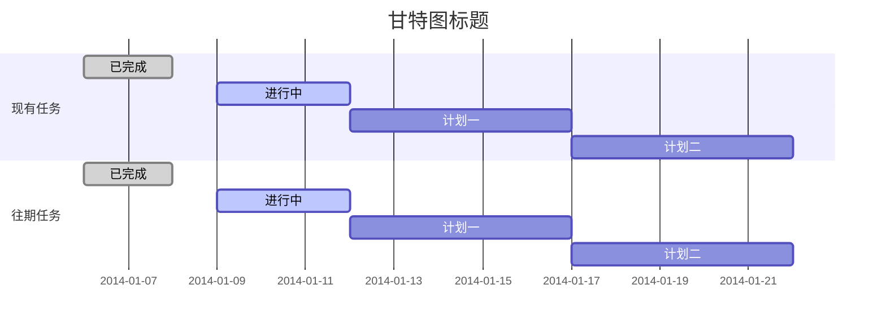

# Markdown使用分享

## 前言

### 起源
`Markdown` 由 `John Gruber` 在2004年创建，是一种可以使用普通文本编辑器编写的标记语言，宗旨：**易读**、**易写**  

### 为什么使用
因为 `Markdown` **易读易写**的特性，相对**轻量**、**简单**、**通用**，并且具有一系列的衍生版本(工具)，用于扩展原初 `Markdown` 不具备的功能，如： `表格` 、 `目录` 、 `脚注` 、 `内嵌HTML` 等等。 对于复杂的内容也有着很好的支持，如： `流程图` 、 `甘特图` 、 `科学公式` 等等

> 虽然各个扩展的语法和渲染有些不同，但是语法基本兼容。  

### 储存

储存的格式支持： `*.md` 、 `*.markdown` 、 `*.mmd` 、 `*.mdown`   

导出的格式： `markdown` 、 `html` 

## 使用

### 常用工具

站点：[editor.md(编辑器)](https://pandao.github.io/editor.md/)、[github](https://github.com)、[gitbook](http://gitbook.com)、 [CSDN](https://www.csdn.net/)、[stackoverflow](http://stackoverflow.com)、[SegmentFault](https://segmentfault.com/)   

工具：[typora(本地)](https://www.typora.io)、[Cmd Markdown(在线)](https://www.zybuluo.com)、[phpstorm(扩展)](http://www.jetbrains.com/phpstorm/)、[vs code(扩展)](https://code.visualstudio.com/)、[sublime text(扩展)](http://www.sublimetext.com)  

强烈推荐：[typora(本地)](https://www.typora.io)

### 常用语法

>  **包括但不仅限于下列语法**

#### 换行

在标准的markdown中，是无法使用回车进行换行，因此如需换行，在行末加入`两个空格符` 或 `<br/>` 符，亦或者敲入一段文字后加入一行或多行空白行。

#### 标题

```
# 一级标题
## 二级标题
### 三级标题
#### 四级标题
##### 五级标题
###### 六级标题
```

#### 加粗

```
**加粗**
__加粗__
```

例子：**加粗**、__加粗__

#### 斜体

```
*斜体*
_斜体_
```

例子：*斜体*、_斜体_

#### 删除线

```
~~删除线~~
```

例子：~~删除线~~

#### 引用文本

```
> 引用文本
```

例子：

> 引用文本

#### 代码块

```
`echo`
```

例子：`echo`

#### 下浮标注

```
H<sub>2</sub>O
```

例子：H<sub>2</sub>O

#### 上浮标注

```
2<sup>10</sup>
```

例子：2<sup>10</sup>

#### 插入URL

```
<mail@qq.com>
```

例子：<mail@qq.com>

#### 插入链接

```
[链接名称](链接地址 "标题")

[链接名称][别名]
[别名]: 链接地址 "标题"
```

例子：

[百度](https://baidu.com "百度呀")

[百度][baidu]

[baidu]: http://baidu.com/ "百度呀"

#### 插入图片

```

```

例子：


#### 插入代码

```
​```php
<?php
echo 'hello world';
​```
```

例子：

```php
<?php
echo 'hello world';
```

#### 无序列表

```
- 一条记录
    - 一条记录
- emmm
```

例子：

- 一条记录
  - 一条记录
- emmm

#### 有序列表

```
1. 这是一条有序列表
    1.  这是一条有序列表
2. 这是一条有序列表
```

例子：

1. 这是一条有序列表
   1. 这是一条有序列表
2. 这是一条有序列表

#### Todo List

```
- [ ] 待完成
- [x] 已完成
```

例子：

- [ ] 待完成

- [x] 已完成

#### 插入表格

```
|默认|居左|居中|居右|
|---|:---|:---:|---:|
|默认|居左|居中|居右|
```

例子：

|默认|居左|居中|居右|
|---|:---|:---:|---:|
|默认|居左|居中|居右|

#### 分折线

```
---
```

例子：

---

#### 脚注

```
创建一个脚注[^footnote]
```

例子：创建一个脚注[^footnote]

[^footnote]: 这是一个脚注

#### HTML

```
<span style="color:red">红色文字</span>
```

例子：<span style="color:red">红色文字</span>

### 扩展

下列扩展使用方式仅在 `typora` 中使用

#### 下浮标注

```
H~2~O
```

例子：H~2~O

#### 上浮标注

```
2^10^
```

例子：2^10^

#### 高亮

```
==高亮==
```

例子：==高亮==

#### 甘特图

属于扩展类，部分编辑器支持

```
​```mermaid
gantt
    dateFormat  YYYY-MM-DD
    title 甘特图标题
    section 现有任务
        已完成               :done,    des1, 2014-01-06,2014-01-08
        进行中               :active,  des2, 2014-01-09, 3d
        计划一               :         des3, after des2, 5d
        计划二               :         des4, after des3, 5d
    section 现有任务
        已完成               :done,    des1, 2014-01-06,2014-01-08
        进行中               :active,  des2, 2014-01-09, 3d
        计划一               :         des3, after des2, 5d
        计划二               :         des4, after des3, 5d
​```
```

例子：



## 结束

有没有发现超简单的​​，希望以上内容能为大家带来更快捷方便的记录方式。

> 该'偷懒'的时候一定不要'勤快'，节约更多的时间在我们更需要的地方哟 ヾ(๑╹◡╹)ﾉ"。
>
> 欲先善其事必先利其器，指定一个自己喜欢的编辑器，并记住快捷按键，比手敲更高效。